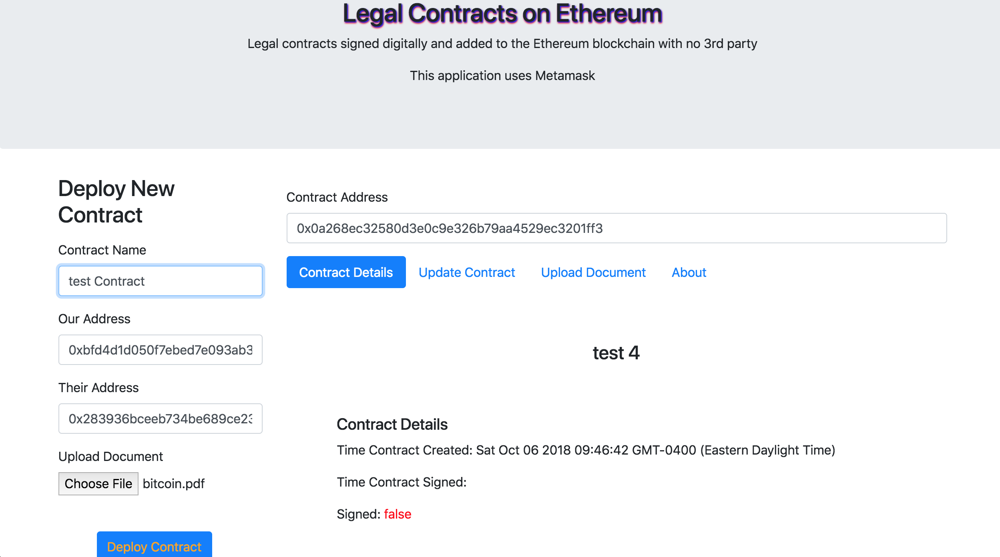

# Legal Contracts on Ethereum
This application was created so that two people or groups can sign a digital contract on the Ethereum blockchain without the need of a 3rd party.
The file that both people sign is uploaded to IPFS and can be downloaded from a link listed when viewing the contract information.

The application runs solely in the browser.  For each pending and current contract that both parties must sign, an Ethereum digital contract must be deployed.  

## Tested Environments
The development for this application has only been tested on **OSX** and the application has only been tested to run on **Google Chrome**.  This application also requires **Metamask**.

## Setup Development Environment
The following software must be installed.
`/usr/bin/ruby -e "$(curl -fsSL https://raw.githubusercontent.com/Homebrew/install/master/install)"`

`brew update;`
    `brew upgrade;`
    `brew tap ethereum/ethereum;`
    `brew install ethereum;`
    `brew install solidity;`
    `brew install git;`
    `brew install node;`
    `brew install nmp;`
    `npm install;`

## Before testing Local Application code changes
When developing for this application, you must run 2 commands before it can be deployed to a server.

- This command compiles the solidity code and application binary interface and then adds the binary code and abi it to the main javascript file dapp_module_final.js `./migrate_solidity_code.sh`
- This command packs up all the required javascript modules into one file which is then used by the webpage
`webpack`

## How to run tests
Before running tests geth must be running in the Rinkeby network
`geth --rinkeby --verbosity 0 console`

To do a test run for the javascript code
`karma start my.config.js --log-level debug --single-run`